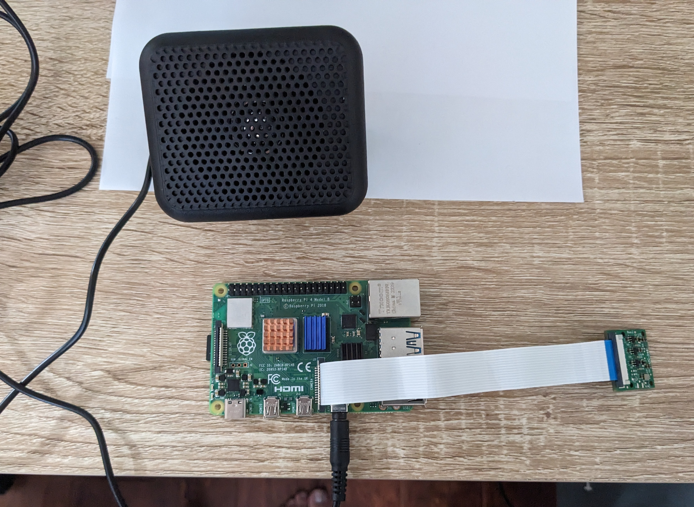

# ESP32 Weather Station
Replace this text with a brief description (2-3 sentences) of your project. This description should draw the reader in and make them interested in what you've built. You can include what the biggest challenges, takeaways, and triumphs from completing the project were. As you complete your portfolio, remember your audience is less familiar than you are with all that your project entails!

You should comment out all portions of your portfolio that you have not completed yet, as well as any instructions:
```HTML 
<!--- This is an HTML comment in Markdown -->
<!--- Anything between these symbols will not render on the published site -->
```

| **Engineer** | **School** | **Area of Interest** | **Grade** |
|:--:|:--:|:--:|:--:|
| Anish R. | Lynbrook High School | Electrical Engineering | Incoming Junior

**Replace the BlueStamp logo below with an image of yourself and your completed project. Follow the guide [here](https://tomcam.github.io/least-github-pages/adding-images-github-pages-site.html) if you need help.**


  
# Final Milestone

**Don't forget to replace the text below with the embedding for your milestone video. Go to Youtube, click Share -> Embed, and copy and paste the code to replace what's below.**

<iframe width="560" height="315" src="https://www.youtube.com/embed/F7M7imOVGug" title="YouTube video player" frameborder="0" allow="accelerometer; autoplay; clipboard-write; encrypted-media; gyroscope; picture-in-picture; web-share" allowfullscreen></iframe>

Since last time, I have been able to add an RGB LED that signals air quality based on its color, cleaned up the way information was being shown on the display, and also made the CO2 PPM readings more accurate with an equation. The LED shines green, yellow, and red, indicating good, fair, and poor air quality, respectively. I cleaned up the display in ways such as displaying units for each measurement. To make the readings more accurate, I plugged the raw voltage values from the gas sensor’s analog output into a function which was a regression equation which I got by plotting my sensor’s values with the real CO2 values in the same area(taken from a more accurate household sensor). This helped to convert the project’s sensor values(which were far off from the more accurate values from the household sensor) into more accurate values. One of my biggest challenges at BSE was coding the project with c++ since I was not very acquainted with the language, sometimes leading to errors such as a large one when I was struggling to convert temperature data to the correct data type for a function. Another challenge was working with the ESP32 when I didn’t fully understand how it worked, such as when my gas sensor was only returning values of 0 since it was connected to the same ADC the WiFi module on it was connected to. A third major challenge was getting the sensor to show accurate readings since its readings were far off from the actual CO2 levels in the area, and this is where I was able to make and use an equation to make the readings more accurate. My biggest triumphs were solving these challenges. Some of the things I learned about BSE were PWM(pulse width modulation), which allows digital components to operate like analog ones, ADCs(Analog-Digital converters), which I learned can only handle conversion for one component at a time, and the power of math in coding as I have one equation in my code which makes the sensor’s raw values that it outputs far more accurate values(in terms of CO2 PPM). I also learned how to integrate several hardware components and an online site while doing the project and about IoT projects in general. In the future I hope to learn more about and apply math’s use in engineering and coding as well as how engineering can be used in practical ways around us and how to make projects with less guidance from tutorials.


# Second Milestone

**Don't forget to replace the text below with the embedding for your milestone video. Go to Youtube, click Share -> Embed, and copy and paste the code to replace what's below.**

<iframe width="560" height="315" src="https://www.youtube.com/embed/ioF2Q5K0R9g?si=t-uc9BIFGQG2-f9l" title="YouTube video player" frameborder="0" allow="accelerometer; autoplay; clipboard-write; encrypted-media; gyroscope; picture-in-picture; web-share" referrerpolicy="strict-origin-when-cross-origin" allowfullscreen></iframe>

For my second milestone, I was able to add a gas sensor to my project which I coded to pick up CO2 readings(in PPM) from its environment. I was also able to get this CO2 data displayed on a site called ThingSpeak. What this modification allows me to do is to collect live data locally and store and visualize it somewhere. I have been surprised by how integrating code from different tutorials to make different parts of the project work(e.g. the sensor, uploading data to ThingSpeak, getting data from OpenWeatherMap) produces bugs which are oftentimes simple to solve. I have also been surprised as to how certain, simple parts of the project and the way parts of it fundamentally work, like making a variable the correct datatype, and not understanding the way the esp32 worked led to major bugs and issues with my project. While completing this milestone, I ran into some issues such as when trying to integrate code to upload data to ThingSpeak with the code I had so far. I was using temperature data from OpenWeatherMap as a placeholder for CO2 data since I had not received the sensor at the start of the week but had  started trying to upload code to ThingSpeak on the first day of the week. I had a hard time uploading the temperature data and eventually found out it was due to its datatype and eventually was able to properly convert the temperature values to a proper data type. I also had issues with the gas sensor only giving readings of 0. After experimenting with the code I had and attempting to debug, my instructor and I realized that the sensor, which gave values in analog, was connected to a pin using the same Analog-Digital converter on the esp32 as the WiFi, allowing us to solve the problem. For my final milestone, I want to fine tune my code to refine the project, make CO2 readings more accurate with a library for the sensor, and complete another milestone, perhaps doing something with the live data from the gas sensor.


# First Milestone

**Don't forget to replace the text below with the embedding for your milestone video. Go to Youtube, click Share -> Embed, and copy and paste the code to replace what's below.**

<iframe width="560" height="315" src="https://www.youtube.com/embed/1Nc4m7QwlBI?si=LO3d6VFibx1tRRjC" title="YouTube video player" frameborder="0" allow="accelerometer; autoplay; clipboard-write; encrypted-media; gyroscope; picture-in-picture; web-share" referrerpolicy="strict-origin-when-cross-origin" allowfullscreen></iframe>

My first milestone was completing my base project which was getting weather data for some city(Lancaster, in my case) through OpenWeatherMap with the esp32 and displaying it on a display module. I wired the esp32 to the display through a breadboard, connecting the display to the esp32’s ground pin and power pin as well as to data pins 21 and 22. This enabled the display to receive power and display things with code through the esp32. I also followed two separate tutorials, one that showed me how to get weather data from OpenWeatherMap and another that showed me how to display things to the display module. After this, I worked to combine the two different codes from the tutorials and now have the display module showing live temperature, pressure, humidity, and wind speed data for Lancaster, US. One challenge I faced was getting data from OpenWeatherMap, as doing so through the code requires an API key, something I was not familiar with. Due to this, I was confused when trying to fetch OpenWeatherMap data but eventually was able to do it. Additionally, when trying to combine the code for the display module and OpenWeatherMap data, I did not fully understand all parts of both codes and how something actually gets displayed to the display. I worked with my instructor to understand how to combine the code without my errors and he also explained the concept of a buffer, which gets built up with each command to display something but must be pushed onto the display with a display.display() command. Another big issue I faced was too much data being displayed on the display, which is less than a square inch large. I tried implementing scrolling to display all the text cleanly, which was not successful, and instead listed out only the important information, as not all information initially displayed was relevant for a user, line by line. My next steps are to do a modification, likely either with a new piece of hardware which could collect local data to be displayed, or by harnessing the esp32’s WiFi capabilities.

# Schematics 


# Code
Here's where you'll put your code. The syntax below places it into a block of code. Follow the guide [here]([url](https://www.markdownguide.org/extended-syntax/)) to learn how to customize it to your project needs. 

```#include <WiFi.h>
#include <HTTPClient.h>
#include <Arduino_JSON.h>
#include <ThingSpeak.h>
#include <typeinfo>

#include <SPI.h>
#include <Wire.h>
#include <Adafruit_GFX.h>
#include <Adafruit_SSD1306.h>

#define SCREEN_WIDTH 128 // OLED display width, in pixels
#define SCREEN_HEIGHT 64 // OLED display height, in pixels

// Declaration for an SSD1306 display connected to I2C (SDA, SCL pins)
#define OLED_RESET     -1 // Reset pin # (or -1 if sharing Arduino reset pin)
Adafruit_SSD1306 display(SCREEN_WIDTH, SCREEN_HEIGHT, &Wire, OLED_RESET);


const char* ssid = "homelan2";
const char* password = "20052009";

WiFiClient  client1;

long myChannelNumber = 3009505;
const char * myWriteAPIKey = "3R9KYPU795ZY35CO";

// Your Domain name with URL path or IP address with path
String openWeatherMapApiKey = "b8bf869b7e68f6dfa92594c52a86f5da";
// Example:
//String openWeatherMapApiKey = "bd939aa3d23ff33d3c8f5dd1dd435";

// Replace with your country code and city
String city = "San%20Jose";
String countryCode = "US";

// THE DEFAULT TIMER IS SET TO 10 SECONDS FOR TESTING PURPOSES
// For a final application, check the API call limits per hour/minute to avoid getting blocked/banned
unsigned long lastTime = 0;
// Timer set to 10 minutes (600000)
//unsigned long timerDelay = 600000;
// Set timer to 10 seconds (10000)
unsigned long timerDelay = 10000;

String jsonBuffer;

String httpGETRequest(const char* serverName);

int redPin = 15;
int greenPin = 0;
int bluePin = 2;

void setup() { 
	// initialize serial communication at 9600 bits per second: 
	Serial.begin(9600); 

  //Defining the pins as OUTPUT
  pinMode(redPin, OUTPUT);
  pinMode(greenPin, OUTPUT);
  pinMode(bluePin, OUTPUT);

  WiFi.mode(WIFI_STA);   
  
  ThingSpeak.begin(client1);  // Initialize ThingSpeak

  // SSD1306_SWITCHCAPVCC = generate display voltage from 3.3V internally
  if(!display.begin(SSD1306_SWITCHCAPVCC, 0x3C)) { 
    Serial.println(F("SSD1306 allocation failed"));
    for(;;); // Don't proceed, loop forever
  }

  // Show initial display buffer contents on the screen --
  // the library initializes this with an Adafruit splash screen.
  display.display();
  delay(2000); // Pause for 2 seconds

  // Clear the buffer
  display.clearDisplay();

  WiFi.begin(ssid, password);
  Serial.println("Connecting");
  while(WiFi.status() != WL_CONNECTED) {
    delay(500);
    Serial.print(".");
  }
  Serial.println("");
  Serial.print("Connected to WiFi network with IP Address: ");
  Serial.println(WiFi.localIP());
 
  Serial.println("Timer set to 10 seconds (timerDelay variable), it will take 10 seconds before publishing the first reading.");
  
} 

void loop() { 
	int rawVal = analogRead(33); // read the input on pin 33, voltage value directly from sensor
  //int finalVal = -0.0445149 * rawVal * rawVal + 23.07454 * rawVal - 1955.74579; //conversion to more accurate PPM(old version)
  
  int finalVal = -0.0178207 * rawVal * rawVal + 4.14761 * rawVal + 1182.57375; //conversion to more accurate PPM(new version)
	  
  // Send an HTTP GET request
  if ((millis() - lastTime) > timerDelay) {
    // Check WiFi connection status
    if(WiFi.status()== WL_CONNECTED){
      String serverPath = "http://api.openweathermap.org/data/2.5/weather?q=" + city + "," + countryCode + "&APPID=" + openWeatherMapApiKey;
      
      jsonBuffer = httpGETRequest(serverPath.c_str());
      Serial.println(jsonBuffer);
      JSONVar myObject = JSON.parse(jsonBuffer);
  
      // JSON.typeof(jsonVar) can be used to get the type of the var
      if (JSON.typeof(myObject) == "undefined") {
        Serial.println("Parsing input failed!");
        return;
      }
      display.setTextSize(1);             // Normal 1:1 pixel scale
      display.setTextColor(WHITE);        // Draw white text
      display.setCursor(0,0);             // Start at top-left corner
    
      Serial.print("JSON object = ");
      float tempfloat = double(myObject["main"]["temp"]);


      display.print("City: ");
      display.println("San Jose");
      //display.println(city);

      display.print("Country: ");
      display.println(countryCode);

      int temp = ((int(myObject["main"]["temp"]) - 273.15) * 1.8 + 32);
      display.print(("Temperature:"));
      display.print(temp);
      display.println(" F");

      display.print(("Pressure:"));
      display.print((myObject["main"]["pressure"]));
      display.println(" hPa");

      display.print(("Humidity: "));
      display.print((myObject["main"]["humidity"]));
      display.println("%");


      display.print(("Wind Speed: "));
      display.print((myObject["wind"]["speed"]));
      display.println(" m/s");

      display.print("CO2(PPM): "); 
	    display.print(finalVal);

      int x = ThingSpeak.writeField(myChannelNumber, 1, finalVal, myWriteAPIKey);

      if (finalVal < 450) {
        setColor(0,255,0);
        display.print("(Good)");
      } else if (finalVal >= 450 && finalVal <= 750) {
        setColor(128,128,0);
        display.print("(Fair)");
      } else {
        setColor(255,0,0);
        display.print("(Poor)");
      }


      if(x == 200){
      Serial.println("Channel update successful.");
      }
      else{
        Serial.println("Problem updating channel. HTTP error code " + String(x));
      }
      lastTime = millis();
      
      display.display();
      delay(3000);
      display.clearDisplay();

    }
    else {
      Serial.println("WiFi Disconnected");
    }
    lastTime = millis();
  }
}  

void setColor(int redValue, int greenValue, int blueValue) {
  analogWrite(redPin, redValue);
  analogWrite(greenPin, greenValue);
  analogWrite(bluePin, blueValue);
}


String httpGETRequest(const char* serverName) {
  WiFiClient client2;
  HTTPClient http;
    
  // Your Domain name with URL path or IP address with path
  http.begin(client2, serverName);
  
  // Send HTTP POST request
  int httpResponseCode = http.GET();
  
  String payload = "{}"; 
  
  if (httpResponseCode>0) {
    Serial.print("HTTP Response code: ");
    Serial.println(httpResponseCode);
    payload = http.getString();
  }
  else {
    Serial.print("Error code: ");
    Serial.println(httpResponseCode);
  }
  // Free resources
  http.end();

  return payload;
}
```

# Bill of Materials
Here's where you'll list the parts in your project. To add more rows, just copy and paste the example rows below.
Don't forget to place the link of where to buy each component inside the quotation marks in the corresponding row after href =. Follow the guide [here]([url](https://www.markdownguide.org/extended-syntax/)) to learn how to customize this to your project needs. 

| **Part** | **Note** | **Price** | **Link** |
|:--:|:--:|:--:|:--:|
| Item Name | What the item is used for | $Price | <a href="https://www.amazon.com/Arduino-A000066-ARDUINO-UNO-R3/dp/B008GRTSV6/"> Link </a> |
| Item Name | What the item is used for | $Price | <a href="https://www.amazon.com/Arduino-A000066-ARDUINO-UNO-R3/dp/B008GRTSV6/"> Link </a> |
| Item Name | What the item is used for | $Price | <a href="https://www.amazon.com/Arduino-A000066-ARDUINO-UNO-R3/dp/B008GRTSV6/"> Link </a> |

# Other Resources/Examples
One of the best parts about Github is that you can view how other people set up their own work. Here are some past BSE portfolios that are awesome examples. You can view how they set up their portfolio, and you can view their index.md files to understand how they implemented different portfolio components.
- [Example 1](https://trashytuber.github.io/YimingJiaBlueStamp/)
- [Example 2](https://sviatil0.github.io/Sviatoslav_BSE/)
- [Example 3](https://arneshkumar.github.io/arneshbluestamp/)

To watch the BSE tutorial on how to create a portfolio, click here.
