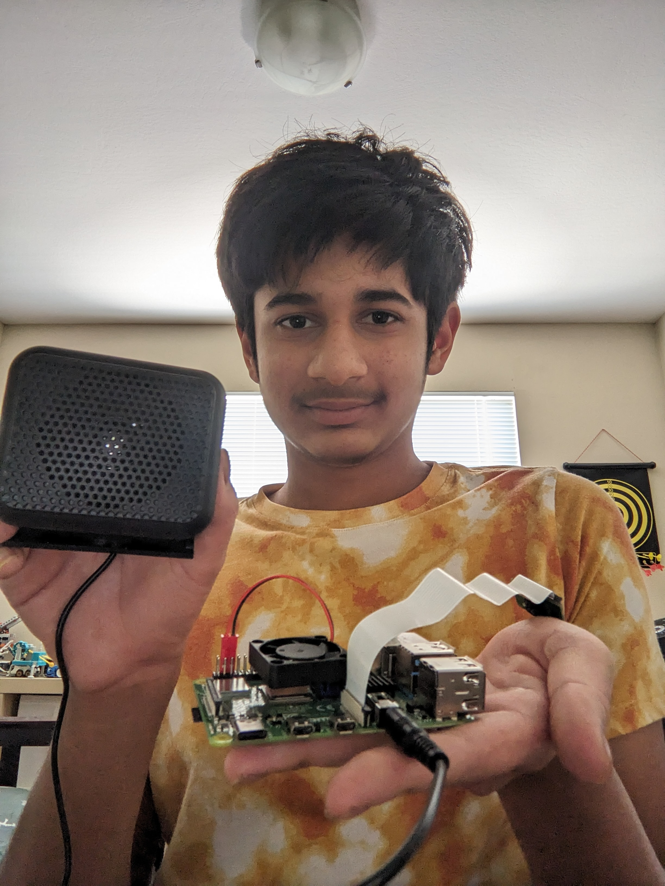
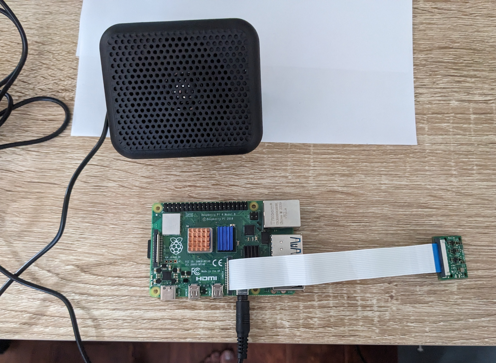

# Raspberry Pi with OCR, Translator, and Speaker Capabilities
Have you ever seen a sign or writing in a foreign language and wanted to know what it meant, but couldn’t read in that language or even know which language it was in? Well with the Optical Character Recognition Raspberry Pi with auto translate to English capabilities and a speaker, worry no more! By doing this project, I have realized what it takes to build an engineering project that is challenging and what it is like to modify it. I also learned what coding is about and how it can be used with hardware in the sense that there can be a little hardware and a lot of software but it is equally important to pay attention to both.

You should comment out all portions of your portfolio that you have not completed yet, as well as any instructions:
```HTML 
<!--- This is an HTML comment in Markdown -->
<!--- Anything between these symbols will not render on the published site -->
```

| **Engineer**  | **School** | **Area of Interest** | **Grade** |
|:--:|:--:|:--:|:--:|
| Anish R. | Lynbrook High School | Electrical Engineering | Incoming Sophomore



  
# Final Milestone

<iframe width="560" height="315" src="https://www.youtube.com/embed/O1HltjNzGrk?si=nWeoPSFlpCm-tkmX" title="YouTube video player" frameborder="0" allow="accelerometer; autoplay; clipboard-write; encrypted-media; gyroscope; picture-in-picture; web-share" referrerpolicy="strict-origin-when-cross-origin" allowfullscreen></iframe>

For my third milestone I added translation from any language into English (namely I tested this feature on German and French). Additionally I connected my Raspberry Pi to a speaker and made the speaker say the translated words out loud with the espeak library. It would also say a few words of advice to the user based off punctuation (eg. an exclamation mark prompts the code to say “Please pay attention to what the words are saying” as there is an emphasis on the words). I also added code to filter out any gibberish as sometimes the Optical Character Recognition would read gibberish(Only part of a word or incorrectly reading text so it thought it was seeing a nonsensical word/string of characters) which the speaker then said out loud. I did this by installing a wordlist full of English words and then checked to see if the words were in the wordlist. I also made sure proper nouns weren’t filtered out either with a library that checked if the words were proper nouns.  

  The biggest challenges I faced were getting my base project set up as I had issues with trying to connect my computer to the Raspberry Pi so I could code it. I also had issues with the base tutorial being outdated, and not just with that but the project was so software oriented I needed to do a lot of online research for code, but most code was from a few years ago so I needed to find newer code. I was additionally challenged with there being limited online resources/help at times like when I was trying to get the speaker to work. After spending a lot of time researching, I only found one person who had working code, and I also had a hard time understanding the code. I hadn’t had a lot of coding experience, so in general it took some time to figure out why certain code (specifically Python) was there and how I could change code. Another large challenge for me was getting the “Gibberish Filter” to work as it was very hard to find a proper word list that only contained proper English words only and one that had information online on how to code it. With this, another issue was trying to make sure that the translated words were in the same format as the words in the word list(if wordlist has lowercase words, then text being compared to it must all be lowercase). 
  
  My major triumphs were gaining the confidence to code in a new programming  language and apply it as I had minimal Python experience but was still able to do my project. Another triumph was getting the speaker to work as it was time-consuming and hard to do research on finding code that worked, but when I did eventually find it it was rewarding. Another major triumph was being able to get the “gibberish filter” working as it took a lot of testing where code wasn’t working, different wordlists, research to find solutions, and thinking about how code works and why problems may arise to get it to work. An example of some of these elements came when I realized that the reason my program wasn’t working at one point was because the word list I was using(NLTK’s wordlist) had non-proper nouns in lowercase only, but some of the translated text started with an uppercase letter. I knew I needed to find a function for Python that could make text lowercase so I did research and, after not too long, found the Python string .lower() method. 
  
  I learned about AI and machine learning with this project, specifically about the issues that come when doing them. I learned that getting the AI/ML to work is not the hard part, but rather applying it. I was also able to learn about Python and how to code in it. I learned about how to do research if I was unsure how to write code(especially when trying to integrate new features/hardware), how to debug code when there were issues, and the basics of how Python code is structured. In the future, I hope I can learn more about Python and other coding languages as well, as before this project, I couldn’t properly understand it. Now that I do have a basic understanding of it though, I feel like I want to know more about it. I also want to know more about how AI/ML works on a base level and delve deeper into how they really work as I have gotten some experience working with them. Finally, I would like to learn more about microcontrollers like the Raspberry Pi  as they allow me to do all sorts of cool and useful projects like the one I did and I would love to know more about them. 


# Second Milestone

<iframe width="560" height="315" src="https://www.youtube.com/embed/_FnQXYTGDo4?si=ZXumB9RFzwgtLY6J" title="YouTube video player" frameborder="0" allow="accelerometer; autoplay; clipboard-write; encrypted-media; gyroscope; picture-in-picture; web-share" referrerpolicy="strict-origin-when-cross-origin" allowfullscreen></iframe>

For my second milestone I added English to Spanish translation to my live text recognition base project and also got my Raspberry Pi camera to livestream footage and recognize text live. I used the same hardware as before (Raspberry Pi 4B and pi camera), but through code I was able to turn on and save pictures of the moments when it was able to read text. The issue with just having this was that sometimes it was hard to position and focus the camera on the text(Set to 1080x1920). I first tried to input some code that my instructor had that could livestream the camera’s character recognition, so it would show if it was recognizing text. However, this code didn’t work, so to fix this I adjusted the code, adding some new lines we thought would help and getting rid of other lines we thought weren’t helping. Eventually I downgraded my OCR library for recognizing text which was a large part of the issues and, after some more changes in the code, got the livestream to work(Set to 720x480). After finishing the base project I then implemented live text translation. I initially referred to this tutorial(https://pyimagesearch.com/2021/09/20/language-translation-and-ocr-with-tesseract-and-python/), but I eventually found out that some of its code was outdated so I ultimately followed this tutorial(https://medium.com/analytics-vidhya/how-to-translate-text-with-python-9d203139dcf5) to finish the translation aspect of this project. I have been surprised by how often bugs in code pop up and how hard it can be to identify why errors arise. On the flip side, I have been pleasantly surprised as to how many online resources there are to solve problems and how much creativity is needed to solve them as well. To finish up this project, I plan to use a speaker to audibly project the translated words. Given enough time, I would also like to implement an interface to provide the user with the ability to choose what languages to translate to and from and/or also provide the user with instructions as to what to do when they see the words.

# First Milestone

<iframe width="560" height="315" src="https://www.youtube.com/embed/qUUw8sn6Nfc?si=T7KP0kq-mFZG-iRr" title="YouTube video player" frameborder="0" allow="accelerometer; autoplay; clipboard-write; encrypted-media; gyroscope; picture-in-picture; web-share" referrerpolicy="strict-origin-when-cross-origin" allowfullscreen></iframe>

For my first milestone I focused on taking pictures and videos using a Raspberry Pi 4 Model B and corresponding Pi camera. Using PuTTY, I remotely connected and sent commands to the Raspberry Pi, telling it when to take the pictures and videos. Since I am following a tutorial, I struggled at times with understanding some aspects of code which made it hard to debug errors. In the coming days I want to better walk through and analyze the code, as this will not only allow me to understand and debug it better, but will also allow me to later add my own modifications. For the next stage of my project I will finish the tutorial and implement live text recognition to my project.

# Schematics 


# Code
The syntax below places it into a block of code. Follow the guide [here]([url](https://www.markdownguide.org/extended-syntax/)) to learn how to customize it to your project needs. 

```python
import cv2
import pytesseract
import spacy
import string
#from wamerican import american_english
#from PyDictionary import PyDictionary
import nltk
from nltk.corpus import words
#from english_words import english_words_alpha_set
#from english_words import english_words_set
from pytesseract import Output
from picamera2 import MappedArray, Picamera2, Preview
from deep_translator import GoogleTranslator
from espeak import espeak
from time import sleep

nltk.download('words')
word_list = set(words.words())
#espeak.set_voice('en-scottish')
def remove_punctuation(test_str):
# Using filter() and lambda function to filter out punctuation characters
  result = ''.join(filter(lambda x: x.isalpha() or x.isdigit() or x.isspace(), test_str))
  return result
print("OpenCV version:", cv2.__version__) 
#cap = cv2.VideoCapture(0)
#cap.set(cv2.CAP_PROP_BUFFERSIZE, 1)
picam2 = Picamera2()
picam2.configure(picam2.create_preview_configuration({"size":(720, 480)}))
picam2.start_preview(Preview.QTGL)
picam2.start()

i = 0 


while True:
    # Capture frame-by-frame
    #ret, frame = cap.read()
    frame=picam2.capture_array()
 
    d = pytesseract.image_to_data(frame, output_type=Output.DICT)
    n_boxes = len(d['text'])
    print(n_boxes)
    for i in range(n_boxes):
        if int(d['conf'][i]) > 60:
            (text, x, y, w, h) = (d['text'][i], d['left'][i], d['top'][i], d['width'][i], d['height'][i])
            # don't show empty text
            if text and text.strip() != "":
                frame = cv2.rectangle(frame, (x, y), (x + w, y + h), (0, 255, 0), 2)               
                frame = cv2.putText(frame, text, (x, y - 10), cv2.FONT_HERSHEY_SIMPLEX, 1.0, (0, 0, 255), 3)
                cv2.imwrite(str(i)+".png", frame)
                i += 0
                to_translate = text
                translated = GoogleTranslator(source='auto', target='en').translate(to_translate)
                apart = translated.split()
                if translated is not None: 
                    apart = translated.split() 
                    for word in apart:
                        #print(translated2)
                        translated2 = remove_punctuation(word)
                        low = translated2.lower()
                        nlp = spacy.load('en_core_web_sm')
                        doc = nlp(translated2)
                        entities = {ent.text for ent in doc.ents}
                        #print(type(translated))
                        #def check(word, list):
                        if low in set(words.words()) or translated2 in entities:
                        #if translated2 in english_words_alpha_set or  english_words_set:
                        #if translated in english_words_alpha_set or english_words_set:
                            print(translated)
                            espeak.set_voice('en-scottish')
                            print('Using voice:', 'en-scottish')
                            #espeak.set_voice('en-scottish')
                            espeak.synth(translated)
                            while espeak.is_playing():
                            #espeak is asynchronous, so wait politely until it's finished
                                sleep(0.25)
                        if translated is not None and "!" in translated:
                            print("Please pay attention to what the words are saying")
                            espeak.set_voice('en-scottish')
                            print('Using voice:', 'en-scottish')
                            #espeak.set_voice('en-scottish')
                            #print("Please pay attention to what the words are saying")
                            espeak.synth("Please pay attention to what the words are saying")
                            while espeak.is_playing():
                                sleep(0.25)
                        if translated is not None and "?" in translated:
                            print("The text is asking a question")
                            espeak.set_voice('en-scottish')
                            print('Using voice:', 'en-scottish')
                            espeak.synth("The text is asking a question")
                            while espeak.is_playing():
                                sleep(0.25) 
                     #Display the resulting frame
    cv2.imshow('frame', frame)
    
 
# When everything done, resleep(0.25)lease the capture
# cap.release()
cv2.destroyAllWindows()
```

# Bill of Materials 

| **Part** | **Note** | **Price** | **Link** |
|:--:|:--:|:--:|:--:|
| Vemico Raspberry Pi 4 Model B | Computer that does OCR and is the brains of the project | $93 | <a href="https://www.amazon.com/Vemico-Raspberry-Starter-Heatsinks-Screwdriver/dp/B09QGZ94M8/"> Link </a> |
| Arudcam  | Where the Raspberry Pi sees everything from | $12.99 | <a href="https://www.amazon.com/gp/product/B07RWCGX5K/"> Link </a> |
| NSP-100 Mini External Speaker | Says the translated words out loud | $15.49 | <a href="https://www.amazon.com/Sanpyl-External-Speaker-NSP-100-Microphone/dp/B0816F2R56"> Link </a> |

# Other Resources/Examples
One of the best parts about Github is that you can view how other people set up their own work. Here are some past BSE portfolios that are awesome examples. You can view how they set up their portfolio, and you can view their index.md files to understand how they implemented different portfolio components.
- [OCR Tutorial]([(https://tutorials-raspberrypi.com/raspberry-pi-text-recognition-ocr/])
- [How to add text recognition for more languages]([https://askubuntu.com/questions/793634/how-do-i-install-a-new-language-pack-for-tesseract-on-16-04/798492#798492])
- [List of Translator]([(https://lokalise.com/blog/how-to-translate-languages-in-python-with-google-translate-and-deepl-plus-more/#Python_translation_libraries])
- [How to use espeak library for speaker]([https://forums.raspberrypi.com/viewtopic.php?t=280403])
- [NLTK worlist to check if words are real English words(For "Gibberish Filter")]([https://www.nltk.org/])
- [ChatGPT Conversation with Information at the end on how to use the Spacy library to check if a word is a proper noun(Other part of "Gibberish Filter")]([https://chatgpt.com/share/6cc9acb7-ccfc-4a12-9d17-6dda4993a882])

To watch the BSE tutorial on how to create a portfolio, click here.
